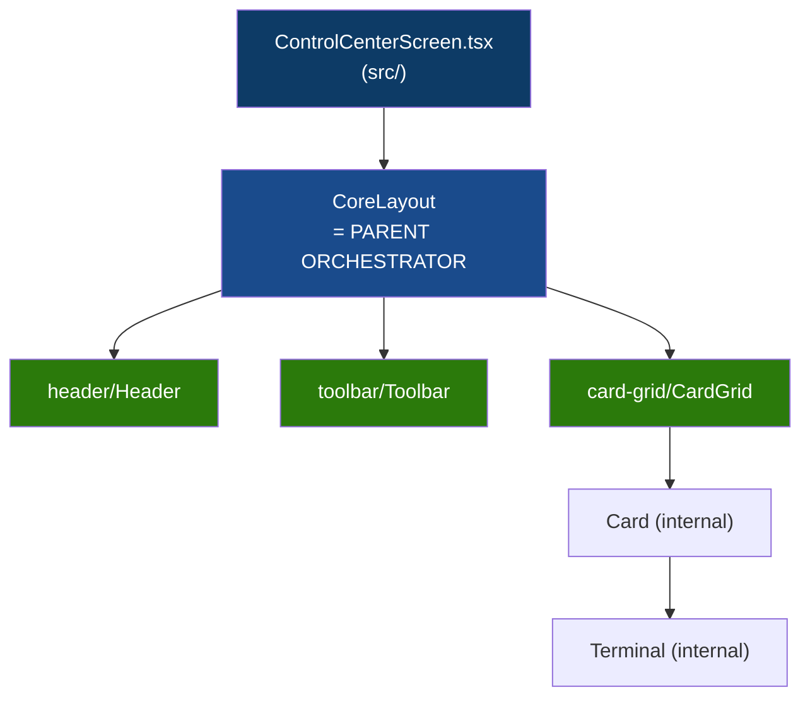

# CoreUI Architecture Analysis (Implemented)

## Status Aktual: Struktur `ui/` (Selesai)

Struktur `ui/` sekarang murni menggunakan pola **CoreUI (Parent-Children Isolation)**. File yang tadinya flat sekarang sudah dikelompokkan berdasarkan batas logic UI, dan parent orchestrator hanya mengatur slot composition.

### File Tree

```text
ui/
├── CoreLayout.tsx               ← PARENT: slot composition + responsive ownership
├── CoreLayout.css               ← Layout CSS (grid utama, slots, positioning)
├── CoreLayout.test.tsx
├── CoreLayout.tokens.css        ← ALL responsive tokens + breakpoints (Single Source of Truth)
│
├── header/                      ← CHILD: header component group
│   ├── Header.tsx
│   ├── Header.css
│   ├── Header.test.tsx
│   └── headerDefinition.ts      ← internal definition
│
├── toolbar/                     ← CHILD: toolbar component group
│   ├── Toolbar.tsx
│   ├── Toolbar.css
│   ├── Toolbar.test.tsx
│   └── toolbarDefinition.ts     ← internal definition
│
└── card-grid/                   ← CHILD: grid + card + terminal as one unit
    ├── CardGrid.tsx             ← entry point yang diexpose ke CoreLayout
    ├── CardGrid.css
    ├── CardGrid.test.tsx
    ├── Card.tsx                 ← internal detail (hidden from parent)
    ├── Card.css
    ├── Card.test.tsx
    ├── Terminal.tsx             ← internal detail (hidden from parent)
    ├── Terminal.test.tsx
    ├── cardDefinition.ts        ← internal definition
    └── gridDefinition.ts        ← internal definition
```

---

## Import Graph & Boundaries (Enforced by ESLint)



### Prinsip yang Berlaku & Ditegakkan:

1. **Parent Knows Slots, Not Internals**: `CoreLayout` hanya merender `<Header />`, `<Toolbar />`, dan `<CardGrid />` ke area layout masing-masing. Parent **tidak tahu** bahwa di dalam CardGrid ada Card dan Terminal.
2. **Child Isolation**: Komponen di dalam `header/` **tidak boleh** meng-import apapun dari `toolbar/` atau `card-grid/`. Mereka juga tidak boleh meng-import `CoreLayout`. Aturan ini dijamin oleh `tooling/eslint/controlCenterBoundaryConfigs.ts`.
3. **No Definition Leaking**: File `*Definition.ts` sekarang 100% internal untuk masing-masing *child*. Layout parent tidak lagi membaca definition secara langsung, mencegah *cross-cutting coupling*.
4. **Swappable Layout**: Dengan pattern di atas, layout Dhepil Suite sangat modular. Jika suatu saat kita butuh *Mobile Layout*, kita hanya perlu membuat `ui/MobileLayout.tsx` yang menggunakan komponen children (`Header`, `Toolbar`, `CardGrid`) dalam susunan CSS grid yang berbeda. Komponen child tidak perlu diubah sama sekali.

---

## Next Action: Responsive & Pixel Audit

Arsitektur foldernya sudah solid. Sisa pekerjaan di UI adalah **mengubah nilai-nilai hardcoded pixel dan memperbaiki overflow/stacking** yang dilaporkan user. 
Implementasi harus difokuskan hanya pada:
- Menambahkan media queries (`@media (max-width: 768px)` dan `480px`) secara terpusat di `CoreLayout.tokens.css`.
- Mengonversi `padding: 16px` menjadi `padding: var(--layout-padding)` di dalam komponen agar responsif-nya bisa diatur otomatis oleh orchestrator.
