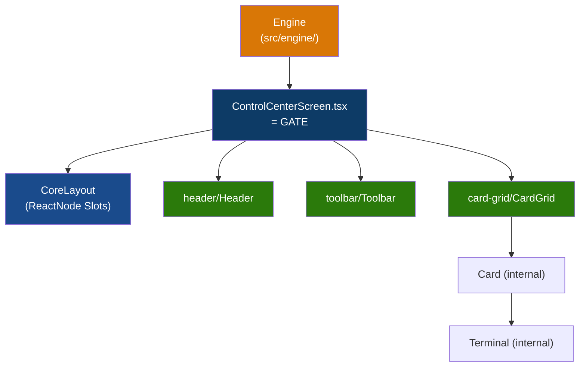

# Dhepil Suite — Master Architecture Playbook

Dokumen ini adalah **satu-satunya sumber kebenaran arsitektur (Single Source of Truth)** untuk Dhepil Suite.
Jika ada AI Agent baru yang masuk, **WAJIB membaca dokumen ini sebelum melakukan perubahan apapun.**

---

## 1. Apa Ini

npm-workspaces monorepo dengan dua workspace pattern:

- `apps/*`: aplikasi Vite yang berdiri sendiri;
- `electron`: shared desktop runtime dan build toolchain.

Root control center berjalan tetap di port `1999`. Dashboard React 19 + antd 6 ini menemukan app secara otomatis, mengunci port, menyalakan/menghentikan dev server, dan memonitor log app lokal.

### Kondisi package aktual

| Package                    | Peran                       | Stable port | Electron |
| -------------------------- | --------------------------- | ----------- | -------- |
| Root `dhepil-suite`        | Local development manager   | `1999`      | N/A      |
| `apps/dhepil`              | App Vite                    | `2000`      | Disabled |
| `apps/spreadsheet-minimal` | App Vite                    | `2001`      | Disabled |
| `apps/clipboard`           | App Vite + desktop opt-in   | `2002`      | Enabled  |
| `electron`                 | Shared runtime/build system | N/A         | Owner    |

Port app tersimpan permanen di `config/app-ports.lock.json`. Root tidak mengganti assignment yang sudah ada secara diam-diam.

## 2. Aturan Pengeditan File (Strict Rules for Agents)

1. **`ui/` Murni Generik & Mandiri**: Komponen di folder `ui/` **DILARANG KERAS** meng-import apapun dari `src/engine/`. `ui/` memiliki tipe data presentasionalnya sendiri di `ui/contracts.ts`.
2. **CoreLayout Slot-Based**: `CoreLayout.tsx` adalah slot-based container (`header`, `toolbar`, `content`, `pageAlert` sebagai `ReactNode`). Parent layout ini tidak tahu ViewModel domain apapun.
3. **Gate Pattern**: File `src/ControlCenterScreen.tsx` bertindak sebagai **Gate** penerjemah. Gate mengambil data murni dari Engine, menyusun data presentasional & copy, lalu merender komponen CoreUI dan menyuapkannya ke slot `<CoreLayout>`.
4. **DILARANG menaruh logic di Parent Component**: File `src/ControlCenterScreen.tsx` dan `ui/CoreLayout.tsx` hanyalah _orchestrator_ pasif. Semua logika visual (seperti format, auto-scroll, kondisi status) HARUS dienkapsulasi di dalam komponen _Child_ terkecil (contoh: `ui/card-grid/Terminal.tsx`).
5. **Flat Engine Children**: File-file logika di `src/engine/children/` harus berupa file TypeScript murni tanpa sub-folder.
6. **Isolasi UI Component**: Komponen di dalam `ui/header/` tidak boleh saling _import_ dengan `ui/toolbar/` atau `ui/card-grid/`. Komunikasi hanya terjadi via props.

---

## 3. Tech Stack & Build Gate

| Tool             | Version |
| ---------------- | ------- |
| React            | 19.2.8  |
| antd             | 6.5.2   |
| TypeScript       | 6.0.3   |
| Vite             | 8.1.5   |
| Vitest           | 4.1.10  |
| Electron         | 43.2.0  |
| electron-builder | 26.15.3 |

Root dan seluruh app menggunakan ESM (`"type": "module"`). CommonJS hanya diizinkan untuk kebutuhan runtime yang memang mensyaratkannya, saat ini:

- `electron/preload/index.cts` → menghasilkan sandboxed preload `.cjs`;
- `electron/scripts/install-electron.cjs` → installer binary Electron.

**Build Gate (wajib lulus semua sebelum commit):**

```bash
npm run format:check
npm run lint
npm run typecheck
npm run test
npm run build
npx --yes antd lint . --format json
```

---

## 4. Panduan Membuat App Baru (`apps/<id>/`)

### 4.1 Ownership

1. Buat direct child baru di `apps/<id>/`; nested app dan symbolic link tidak didukung.
2. ID folder wajib lowercase kebab-case, misalnya `my-new-app`.
3. App memiliki logic, state, persistence, dan Gate/Composition Root miliknya sendiri.
4. Visual reusable berada di root `ui/` dan menerima kontrak generik dari `ui/contracts.ts`.
5. App tidak boleh meng-import source app lain atau business logic root control center.
6. UI baru wajib memakai Ant Design 6 jika primitive yang sesuai sudah tersedia.
7. Seluruh app mewarisi `apps/AGENTS.md`; tambahkan `apps/<id>/AGENTS.md` untuk ownership/aturan khusus app, bukan untuk mengganti kontrak parent.

### 4.2 File minimum

Buat `app.manifest.json`:

```json
{
  "schemaVersion": 1,
  "id": "my-new-app",
  "name": "Human Readable Name",
  "runtime": "vite",
  "description": "Deskripsi singkat app.",
  "desktop": {
    "enabled": false,
    "script": "desktop:dev"
  }
}
```

Buat `package.json` dengan minimum:

```json
{
  "name": "@dhepil-suite/my-new-app",
  "version": "0.1.0",
  "private": true,
  "type": "module",
  "scripts": {
    "dev": "vite",
    "build": "npm run typecheck && vite build",
    "typecheck": "tsc --noEmit"
  }
}
```

App Vite juga memerlukan `index.html`, `vite.config.ts`, `tsconfig.json`, dan entry React-nya.

`0.1.0` adalah version bootstrap app baru. Setelah package dibuat, jangan bump version atau menulis `CHANGELOG.md` manual. `CHANGELOG.md` boleh belum ada; automation root akan membuat baseline ketika release pertama. Jangan menambahkan version lain ke `app.manifest.json` karena `schemaVersion` hanya versi format manifest.

Tambahkan `apps/<id>/AGENTS.md` minimal yang menyatakan folder tersebut dimiliki app, melarang import root/app lain, dan merujuk kembali ke `apps/AGENTS.md`. Jangan menyalin seluruh playbook ke dalam app.

### 4.3 Discovery dan stable port

1. Jalankan `npm install` dari root agar workspace baru tertaut.
2. Jalankan root dengan `npm run dev`.
3. Buka `http://127.0.0.1:1999`, lalu tekan **Refresh**.
4. Root memindai `apps/*`, memvalidasi manifest/package, lalu mengalokasikan port kosong permanen pada range `2000–2999`.
5. Jangan mengedit atau menghapus assignment `config/app-ports.lock.json` hanya untuk mengganti port.

Tidak ada file registry app manual. App baru muncul dari folder + manifest + package yang valid.

### 4.4 Validation dan release pertama

Validasi app baru sebelum source di-commit:

```bash
npm run typecheck --workspace @dhepil-suite/my-new-app
npm run build --workspace @dhepil-suite/my-new-app
npx --yes antd lint apps/my-new-app/src --format json
```

Commit source app menggunakan pesan conventional yang menjelaskan perubahan. Setelah working tree bersih, release pertama hanya memerlukan:

```bash
npm run release:check
npm run release:app -- my-new-app
```

Run pertama membuat baseline/tag `my-new-app-v0.1.0` tanpa menghitung atau menaikkan version manual. Release berikutnya menentukan bump dari commit relevan, memperbarui package/lock/changelog, memvalidasi app, lalu membuat commit dan tag lokal. Tooling tidak pernah push.

Jika app desktop juga sengaja merilis perubahan shared Electron, gunakan:

```bash
npm run release:app -- my-new-app --include-electron
```

`desktop:build` bukan pengganti command release dan tidak mengubah version/changelog.

---

## 5. Repository Structure

```
dhepil-suite/
├─ ui/                    ← shared generic CoreUI
│  ├─ card-grid/          ← project cards + process terminal
│  ├─ data-grid/          ← generic editable data grid
│  ├─ header/             ← generic header
│  ├─ theme/              ← shared AntD theme provider/toggle
│  ├─ toolbar/            ← generic control toolbar
│  ├─ contracts.ts        ← presentational contracts
│  └─ CoreLayout.tsx      ← slot-based root layout
├─ src/                   ← root control center app (port 1999)
│  ├─ engine/
│  │  └─ children/        ← flat application operations
│  ├─ controlCenterDefinitions.ts ← static copy/label Control Center
│  ├─ ControlCenterScreen.tsx     ← Gate (penghubung Engine & CoreUI slots)
│  ├─ App.tsx
│  └─ main.tsx
├─ apps/
│  ├─ AGENTS.md          ← inherited rules untuk seluruh app baru
│  ├─ clipboard/          ← desktop-enabled app
│  ├─ dhepil/             ← web/dev app
│  └─ spreadsheet-minimal/ ← web/dev app
├─ electron/              ← shared desktop runtime + build/release orchestrator
│  ├─ main/               ← generic Electron main process
│  ├─ preload/            ← sandbox-compatible shared preload
│  ├─ scripts/            ← dev/build/cache tooling
│  ├─ dist/               ← generated shared runtime (ignored)
│  └─ release/<app-id>/   ← generated standalone artifact (ignored)
├─ config/
│  └─ app-ports.lock.json ← port assignment permanen (2000-2999)
├─ scripts/               ← Vite middleware plugin (Node.js API)
├─ tooling/               ← ESLint boundaries + automatic app release engine
├─ test/                  ← architecture boundary tests
├─ .ai/                   ← transient implementation status + handoff
└─ PLAYBOOK.md            ← File ini (Master Guide)
```

---

## 6. Engine Architecture (`src/engine/`)

- **Parent orchestrator**: `engine/index.ts` menautkan semua children dan mengekspos public API.
- **Flat children**: `engine/children/` hanya berisi file `.ts` langsung (misal: `projectLifecycle.ts`). Jangan buat subfolder.
- **Bebas UI**: `src/engine/` tidak meng-import apapun dari `ui/` dan tidak memiliki tipe ViewModel visual.

---

## 7. CoreUI Encapsulation & Slot-Based Layout (`ui/`)

Struktur `ui/` murni menggunakan pola **Parent-Children Isolation & Gate Slot Composition**.



**Aturan UI:**

- **Fully Generic & Decoupled**: `ui/` mengelola kontrak props-nya sendiri di `ui/contracts.ts`.
- **Slot-Based Layout**: `CoreLayout` menerima `header`, `toolbar`, `content`, `pageAlert` sebagai `ReactNode`. Parent layout ini tidak tahu ViewModel domain apapun.
- **No Definition Leaking**: File copy/label spesifik app disuplai oleh Gate aplikasi yang bersangkutan.

---

## 8. Scripts & API (`scripts/`)

Module dependency berjalan 1 arah (tidak boleh _circular_):
`project-contracts` → `project-discovery / port-registry / process` → `project-manager`

**API Endpoints:**

| Method | Path                      | Deskripsi                                  |
| ------ | ------------------------- | ------------------------------------------ |
| `GET`  | `/api/projects`           | Rescan `apps/*`, return `ProjectSummary[]` |
| `POST` | `/api/projects/:id/start` | Start managed process                      |
| `POST` | `/api/projects/:id/stop`  | Stop managed process                       |

---

## 9. Project Status Model

| Status          | Makna                               |
| --------------- | ----------------------------------- |
| `stopped`       | Folder valid, server mati           |
| `starting`      | Process ada, HTTP belum siap        |
| `running`       | HTTP responding                     |
| `stopping`      | Kill in progress                    |
| `error`         | Spawn gagal                         |
| `invalid`       | Manifest/package.json invalid       |
| `external`      | Port responding, bukan milik root   |
| `port-conflict` | Port terpakai, tidak terverifikasi  |
| `not-found`     | Folder dihapus, process masih hidup |

---

## 10. Electron Desktop Packaging

### 10.1 Ownership

`electron/` adalah **satu-satunya owner** untuk Electron di monorepo:

- `electron/main/` dan `electron/preload/` adalah shell generik; dilarang memuat business logic app.
- `electron/package.json` memiliki satu instalasi Electron 43.2.0 dan electron-builder.
- `electron/scripts/desktop.mjs` menangani dev, typecheck renderer, build renderer dengan asset relatif, staging terisolasi, dan packaging per app.
- `electron/scripts/install-electron.cjs` memakai binary lokal/cache jika tersedia dan fallback download yang dapat dilanjutkan.
- Root hanya menyediakan workspace dan command entry point. Jangan memindahkan dependency Electron ke root atau ke `apps/<id>/`.
- App tidak boleh memiliki `main`, `preload`, konfigurasi electron-builder, atau dependency Electron sendiri.

Satu instalasi toolchain menghindari duplikasi dependency saat development. Setiap artifact final tetap standalone, sehingga masing-masing release secara normal membawa Chromium/Node/Electron miliknya sendiri dan dapat dijalankan tanpa Dhepil Suite.

### 10.2 Kontrak dan prasyarat app

Sebelum mengaktifkan Electron, app harus:

- berada langsung di `apps/<id>/`;
- mempunyai manifest Vite valid;
- mempunyai `package.json`, `tsconfig.json`, dan `vite.config.ts`;
- lulus `npm run typecheck --workspace <package-name>`;
- sudah mendapat stable port jika akan memakai `desktop:dev`.

Electron orchestrator membaca renderer app sebagai build input, tetapi tidak meng-import business logic app ke shared main/preload.

### 10.3 Langkah menambahkan Electron ke app

Gunakan `apps/my-new-app` sebagai contoh.

#### Langkah 1 — aktifkan manifest

Ubah bagian `desktop` di `apps/my-new-app/app.manifest.json`:

```json
{
  "schemaVersion": 1,
  "id": "my-new-app",
  "name": "My New App",
  "runtime": "vite",
  "desktop": {
    "enabled": true,
    "script": "desktop:dev",
    "appId": "com.dhepil.my.new.app",
    "productName": "My New App",
    "icon": "assets/icon.png"
  }
}
```

Kontrak metadata:

| Field         | Wajib | Arti                                                                  |
| ------------- | ----- | --------------------------------------------------------------------- |
| `enabled`     | Ya    | Harus `true` agar app ikut `desktop:build:all`.                       |
| `script`      | Ya    | Nama npm script dev desktop; convention project adalah `desktop:dev`. |
| `appId`       | Tidak | Reverse-domain ID; default diturunkan menjadi `com.dhepil.<app-id>`.  |
| `productName` | Tidak | Nama executable/installer; default memakai `manifest.name`.           |
| `icon`        | Tidak | Path relatif di dalam folder app; default `electron/icon.png`.        |

Aturan tambahan:

- `desktop.script` wajib benar-benar ada di `package.json` ketika `enabled: true`.
- `appId` harus mempunyai beberapa segmen yang dipisahkan `.`, `_`, atau `-`.
- `productName` tidak boleh mengandung karakter Windows `<>:"/\|?*` atau control character.
- Icon custom harus ada dan tidak boleh menunjuk keluar dari folder app.
- `package.json.version` menjadi versi installer.

Jika tidak membutuhkan icon custom, hapus field `icon`; jangan menyalin default icon ke setiap app.

#### Langkah 2 — tambahkan thin scripts

Tambahkan dua delegasi berikut ke `apps/my-new-app/package.json`:

```json
{
  "scripts": {
    "desktop:dev": "node ../../electron/scripts/desktop.mjs dev my-new-app",
    "desktop:build": "node ../../electron/scripts/desktop.mjs build my-new-app"
  }
}
```

`desktop:dev` wajib karena direferensikan manifest. `desktop:build` adalah convention agar app dapat dibangun langsung melalui npm workspace.

**Dilarang** menambahkan ini ke package app:

- dependency `electron` atau `electron-builder`;
- field `main`;
- konfigurasi `build` milik electron-builder;
- folder `electron/`, `main/`, atau `preload/`.

Semua itu sudah dimiliki shared workspace `electron`.

#### Langkah 3 — pastikan stable port

`desktop:dev` membaca `config/app-ports.lock.json`. Untuk app baru:

1. jalankan `npm run dev` dari root;
2. buka control center port `1999`;
3. tekan **Refresh** sampai app muncul dan mendapat port;
4. hentikan dev server root jika tidak lagi dibutuhkan.

Jika langkah ini dilewati, desktop dev berhenti dengan pesan `No stable port is assigned`.

#### Langkah 4 — jalankan desktop development

```bash
npm run desktop:dev -- my-new-app
```

Orchestrator akan:

1. memvalidasi manifest/package;
2. mengompilasi shared main/preload;
3. menyalakan Vite pada stable port app;
4. membuka Electron menggunakan renderer URL tersebut;
5. membersihkan child environment `ELECTRON_RUN_AS_NODE`.

Tutup window Electron atau tekan `Ctrl+C` untuk menutup sesi development.

#### Langkah 5 — unpacked smoke build

```bash
npm run desktop:build -- my-new-app --dir
```

Jalankan executable:

```text
electron/release/my-new-app/win-unpacked/My New App.exe
```

Periksa minimum:

- window terbuka dan responsive;
- asset CSS/JS termuat melalui `file://`;
- fungsi app utama bekerja;
- tidak ada preload error;
- menutup app tidak meninggalkan process.

#### Langkah 6 — siapkan version release dan buat installer final

Smoke build boleh dilakukan kapan saja dan tidak menaikkan version. Untuk artifact final, commit source sampai working tree bersih, biarkan release automation menentukan version/changelog, lalu build installer:

```bash
npm run release:check
npm run release:app -- my-new-app
npm run desktop:build -- my-new-app
```

Tambahkan `--include-electron` pada command release hanya bila perubahan shared `electron/` memang bagian dari release app tersebut. Jangan edit `package.json#version` atau `CHANGELOG.md` untuk menamai installer.

Hasil:

```text
electron/release/my-new-app/
├─ My New App-Setup-<package-version>.exe
├─ My New App-Setup-<package-version>.exe.blockmap
└─ win-unpacked/
```

Setiap build membersihkan `electron/release/<app-id>/` terlebih dahulu. Jangan menyimpan file manual di dalam folder release karena akan terhapus saat rebuild.

### 10.4 Command reference

Jalankan dari root:

```bash
npm run desktop:dev -- clipboard
npm run desktop:build -- clipboard
npm run desktop:build -- clipboard --dir
npm run desktop:build:all
npm run desktop:build:all -- --dir
```

Per-app alias:

```bash
npm run desktop:dev --workspace @dhepil-suite/clipboard
npm run desktop:build --workspace @dhepil-suite/clipboard
```

Perilaku command:

- `desktop:dev` memakai stable port dari `config/app-ports.lock.json`.
- `desktop:build -- <id> --dir` hanya membuat unpacked artifact.
- `desktop:build -- <id>` membuat installer Windows NSIS x64.
- `desktop:build:all` memindai manifest dengan `desktop.enabled: true` dan membangun secara berurutan.
- Satu app invalid/gagal akan menghentikan `build-all`; perbaiki app tersebut lalu ulangi.
- Runtime compile berada di `electron/dist/`.
- Release berada di `electron/release/<app-id>/`.
- Temporary staging berada di OS temp agar production dependency root tidak ikut masuk `app.asar`.
- Desktop build membaca version app yang sudah ada; build tidak bump version, menulis changelog, membuat tag, atau melakukan push.

Dev launcher selalu membuang `ELECTRON_RUN_AS_NODE` hanya dari child environment agar Electron tidak salah berjalan sebagai Node. Data development tiap app diisolasi melalui ID app; release menggunakan metadata ID yang sama.

### 10.5 Menonaktifkan Electron

Ubah manifest menjadi:

```json
{
  "desktop": {
    "enabled": false,
    "script": "desktop:dev"
  }
}
```

App tidak lagi ikut `desktop:build:all`. Web dev server, folder app, dan stable port tetap ada. Generated release lama tidak dihapus otomatis hanya karena manifest dinonaktifkan.

### 10.6 Binary cache

`electron/scripts/install-electron.cjs` mencari archive ini terlebih dahulu:

```text
D:\ARTIFACT\electron-cache\electron-v43.2.0-win32-x64.zip
```

Lokasi dapat diganti dengan `ELECTRON_LOCAL_SEED_DIR`. Jika seed tidak ada, script memakai `ELECTRON_MIRROR` atau mirror default dengan `curl` resume/retry, lalu fallback ke installer Electron resmi dari package npm.

### 10.7 Batasan dan troubleshooting

| Gejala                                     | Pemeriksaan/fix                                                                    |
| ------------------------------------------ | ---------------------------------------------------------------------------------- |
| `Desktop is not enabled`                   | Set `desktop.enabled: true`.                                                       |
| Package harus mempunyai `desktop:dev`      | Samakan `desktop.script` dengan script package.                                    |
| `No stable port is assigned`               | Jalankan root control center dan Refresh agar port terkunci.                       |
| `desktop.appId is not valid`               | Pakai reverse-domain ID seperti `com.dhepil.my.app`.                               |
| `productName` ditolak                      | Hapus karakter terlarang Windows.                                                  |
| Icon tidak ditemukan                       | Perbaiki path relatif atau hapus field `icon` untuk memakai default.               |
| App berjalan sebagai Node                  | Jangan membuat launcher sendiri; orchestrator resmi membersihkan env child.        |
| Ukuran artifact ratusan MB                 | Normal: setiap app standalone membawa Electron/Chromium sendiri.                   |
| Ingin mengubah main/preload untuk satu app | Jangan duplikasi shell; perluas shared contract generik setelah use case terbukti. |

Target packaging saat ini sengaja **Windows NSIS x64**. Dukungan macOS/Linux harus ditambahkan satu kali di `electron/scripts/desktop.mjs`, bukan diduplikasi di setiap app.

---

## 11. Automatic App Versioning dan Changelog

Versi setiap app berdiri sendiri. Source of truth-nya adalah `apps/<id>/package.json#version`; field `schemaVersion` pada manifest hanya versi format manifest, bukan versi release app. Root package dan package Electron adalah metadata toolchain bersama dan tidak ikut naik saat satu app dirilis.

Developer tidak perlu menghitung versi, mengedit `CHANGELOG.md`, membuat commit release, atau membuat tag secara manual. Jalankan salah satu command root:

```bash
npm run release:check
npm run release:changed
npm run release:app -- clipboard
```

- `release:check` hanya menampilkan rencana dan tidak menulis file.
- `release:changed` merilis semua app yang mempunyai commit relevan sejak tag masing-masing.
- `release:app -- <id>` memproses satu app saja.
- Tambahkan `--include-electron` hanya bila perubahan shared Electron memang harus dianggap sebagai perubahan app desktop tersebut.

Automation menemukan app langsung dari `apps/*`; tidak ada registry release manual. Perubahan di `apps/<id>/` hanya memengaruhi app itu. Perubahan di shared `ui/` dianggap memengaruhi semua app. Folder `electron/` sengaja tidak dihitung secara default karena perubahan runtime Electron tidak selalu berarti app harus dibangun atau dirilis ulang.

### 11.1 Aturan versi otomatis

| Commit relevan                                                | Bump  |
| ------------------------------------------------------------- | ----- |
| `!` atau footer `BREAKING CHANGE`                             | major |
| `feat`                                                        | minor |
| `fix`, `perf`, `refactor`, `revert`, `build`, atau `security` | patch |
| `chore(deps)`                                                 | patch |
| commit non-conventional                                       | patch |
| `docs`, `test`, `style`, `ci`, atau `chore` biasa             | none  |

Bump tertinggi menang. Commit `chore(release): ...` selalu diabaikan agar release tidak memicu release berikutnya.

Tag memakai format `<app-id>-v<version>`, misalnya `clipboard-v0.2.0`. Jika app belum memiliki tag, run pertama membuat tag bootstrap pada versi package saat ini tanpa bump. Setelah itu package version dan tag terakhir harus sama; mismatch dianggap drift dan command berhenti.

### 11.2 Guardrail dan hasil release

Release nyata hanya berjalan pada working tree yang bersih. Tooling kemudian:

1. menghitung commit relevan dan versi berikutnya;
2. memperbarui package app, entri workspace pada `package-lock.json`, dan changelog app;
3. menjalankan typecheck dan renderer build hanya untuk app terdampak;
4. memulihkan file release ke kondisi awal jika validasi gagal;
5. membuat commit release lokal dan annotated tag lokal;
6. tidak pernah melakukan push.

Build atau installer Electron juga tidak dijalankan otomatis. Setelah release berhasil, packaging tetap command terpisah:

```bash
npm run desktop:build -- clipboard --dir
npm run desktop:build -- clipboard
```

Untuk app baru, cukup mulai dari version semver valid pada `package.json`. `CHANGELOG.md` boleh belum ada; automation akan membuat baseline saat release pertama.

Kontrak khusus app baru:

1. scaffold selalu mulai dari `0.1.0`;
2. source app divalidasi dan di-commit lebih dahulu;
3. working tree harus bersih sebelum release nyata;
4. agent/developer hanya menjalankan command release—tidak memilih version atau menulis changelog;
5. app plan tidak boleh berisi todo manual untuk bump version, edit changelog, atau membuat tag;
6. packaging Electron dijalankan setelah release hanya ketika artifact installer memang dibutuhkan.
