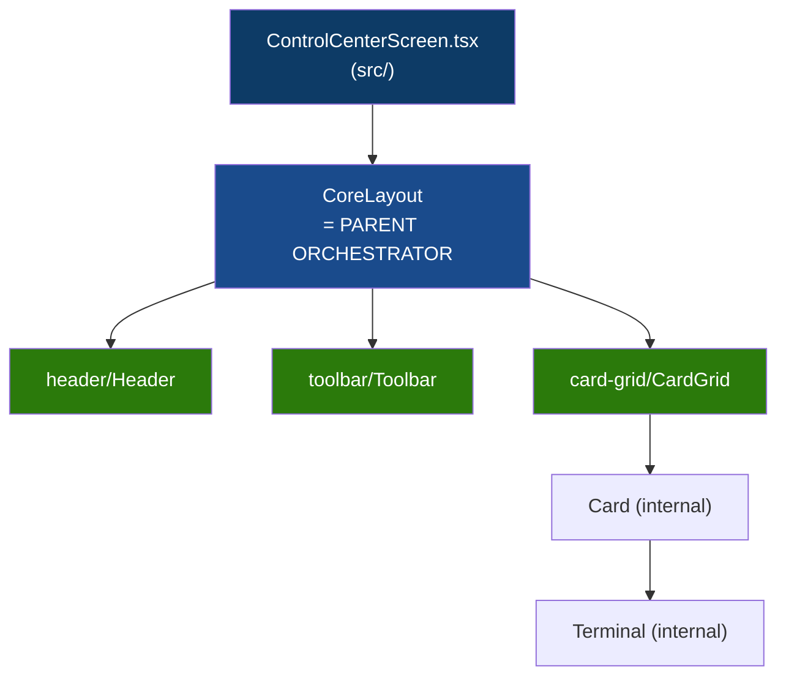

# Dhepil Suite — Master Architecture Playbook

Dokumen ini adalah **satu-satunya sumber kebenaran arsitektur (Single Source of Truth)** untuk Dhepil Suite.
Jika ada AI Agent baru yang masuk, **WAJIB membaca dokumen ini sebelum melakukan perubahan apapun.**

---

## 1. Apa Ini
npm-workspaces monorepo (`apps/*`) dengan **root control center** di port `1999` — sebuah React 19 + antd 6 dashboard yang mengelola, menyalakan, menghentikan, dan memonitor log app Vite lokal.

## 2. Aturan Pengeditan File (Strict Rules for Agents)
1. **DILARANG menaruh logic di Parent Component**: File `src/ControlCenterScreen.tsx` (Parent Engine) dan `ui/CoreLayout.tsx` (Parent UI) hanyalah *orchestrator* pasif (dumb pass-through). **Semua logika fitur (seperti format, auto-scroll, kondisi status) HARUS dienkapsulasi di dalam komponen *Child* terkecil (contoh: `ui/card-grid/Terminal.tsx`).**
2. **Tidak ada layer Presenter**: Jangan buat folder `presenters/` atau Controller Hook terpisah. Screen sudah cukup sebagai batas *composition*.
3. **Flat Engine Children**: File-file logika di `src/engine/children/` harus berupa file TypeScript murni tanpa sub-folder.
4. **Isolasi UI Component**: Komponen di dalam `ui/header/` tidak boleh saling *import* dengan `ui/toolbar/` atau `ui/card-grid/`. Komunikasi hanya terjadi via properti *ViewModel*.

---

## 3. Tech Stack & Build Gate

| Tool       | Version |
| ---------- | ------- |
| React      | 19      |
| antd       | 6.5.1   |
| TypeScript | 6       |
| Vite       | 7       |
| Vitest     | 4       |

ESM only (`"type": "module"`). No CommonJS.
**Build Gate (wajib lulus semua sebelum commit):**
```bash
npm run format:check
npm run lint
npm run typecheck
npm run test
npm run build
npx --yes antd lint src --format json
```

---

## 4. Panduan Membuat App Baru (`apps/<id>/`)
1. Buat folder baru di dalam `apps/` (contoh: `apps/my-new-app/`).
2. App **DILARANG** memuat kode UI dari app lain, dan dilarang mengubah source code `src/` (Root Control Center).
3. Buat file `app.manifest.json` minimal:
```json
{
  "schemaVersion": 1,
  "id": "my-new-app",
  "name": "Human Readable Name",
  "runtime": "vite"
}
```
4. Buat file `package.json` yang berisi script `"dev": "..."`.
5. **Selesai!** App akan otomatis terbaca oleh dashboard pada *polling* berikutnya. Tidak perlu edit *registry* secara manual.

---

## 5. Repository Structure
```
dhepil-suite/
├─ ui/                    ← shared UI components (CoreUI Encapsulation)
├─ src/                   ← root control center app (port 1999)
│  ├─ engine/             ← semua logic (parent orchestrator + children)
│  ├─ ControlCenterScreen.tsx
│  ├─ App.tsx
│  └─ main.tsx
├─ apps/
│  └─ <app-id>/           ← app isolasi (baca Panduan Membuat App Baru)
├─ config/
│  └─ app-ports.lock.json ← port assignment permanen (2000-2999)
├─ scripts/               ← Vite middleware plugin (Node.js API)
├─ tooling/               ← ESLint boundary configs
├─ test/                  ← architecture boundary tests
└─ PLAYBOOK.md            ← File ini (Master Guide)
```

---

## 6. Engine Architecture (`src/engine/`)
- **Parent orchestrator**: `engine/index.ts` menautkan semua children dan mengekspos public API.
- **Flat children**: `engine/children/` hanya berisi file `.ts` langsung (misal: `projectLifecycle.ts`). Jangan buat subfolder.
- **Domain flat**: File seperti `projectActionPolicy.ts` berada langsung di root `engine/`.

---

## 7. CoreUI Encapsulation (`ui/`)
Struktur `ui/` murni menggunakan pola **Parent-Children Isolation**.



**Aturan UI:**
- **Parent Knows Slots, Not Internals**: `CoreLayout` hanya merender `<Header />`, `<Toolbar />`, dan `<CardGrid />`. Ia tidak tahu menahu soal `Terminal` di dalam `CardGrid`.
- **No Definition Leaking**: File `*Definition.ts` adalah 100% internal untuk masing-masing *child*. Layout parent tidak membaca file ini secara langsung.

---

## 8. Scripts & API (`scripts/`)
Module dependency berjalan 1 arah (tidak boleh *circular*):
`project-contracts` → `project-discovery / port-registry / process` → `project-manager`

**API Endpoints:**
| Method | Path                      | Deskripsi                                  |
| ------ | ------------------------- | ------------------------------------------ |
| `GET`  | `/api/projects`           | Rescan `apps/*`, return `ProjectSummary[]` |
| `POST` | `/api/projects/:id/start` | Start managed process                      |
| `POST` | `/api/projects/:id/stop`  | Stop managed process                       |

---

## 9. Project Status Model
| Status          | Makna                               |
| --------------- | ----------------------------------- |
| `stopped`       | Folder valid, server mati           |
| `starting`      | Process ada, HTTP belum siap        |
| `running`       | HTTP responding                     |
| `stopping`      | Kill in progress                    |
| `error`         | Spawn gagal                         |
| `invalid`       | Manifest/package.json invalid       |
| `external`      | Port responding, bukan milik root   |
| `port-conflict` | Port terpakai, tidak terverifikasi  |
| `not-found`     | Folder dihapus, process masih hidup |
