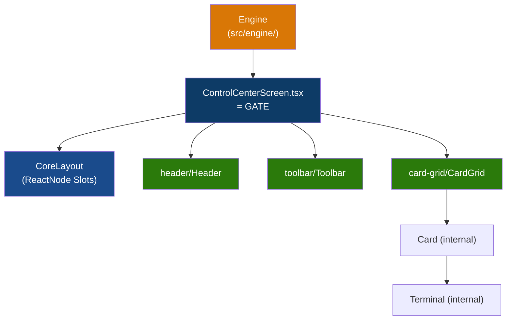

# Dhepil Suite — Master Architecture Playbook

Dokumen ini adalah **satu-satunya sumber kebenaran arsitektur (Single Source of Truth)** untuk Dhepil Suite.
Jika ada AI Agent baru yang masuk, **WAJIB membaca dokumen ini sebelum melakukan perubahan apapun.**

---

## 1. Apa Ini

npm-workspaces monorepo (`apps/*`) dengan **root control center** di port `1999` — sebuah React 19 + antd 6 dashboard yang mengelola, menyalakan, menghentikan, dan memonitor log app Vite lokal.

## 2. Aturan Pengeditan File (Strict Rules for Agents)

1. **`ui/` Murni Generik & Mandiri**: Komponen di folder `ui/` **DILARANG KERAS** meng-import apapun dari `src/engine/`. `ui/` memiliki tipe data presentasionalnya sendiri di `ui/contracts.ts`.
2. **CoreLayout Slot-Based**: `CoreLayout.tsx` adalah slot-based container (`header`, `toolbar`, `content`, `pageAlert` sebagai `ReactNode`). Parent layout ini tidak tahu ViewModel domain apapun.
3. **Gate Pattern**: File `src/ControlCenterScreen.tsx` bertindak sebagai **Gate** penerjemah. Gate mengambil data murni dari Engine, menyusun data presentasional & copy, lalu merender komponen CoreUI dan menyuapkannya ke slot `<CoreLayout>`.
4. **DILARANG menaruh logic di Parent Component**: File `src/ControlCenterScreen.tsx` dan `ui/CoreLayout.tsx` hanyalah _orchestrator_ pasif. Semua logika visual (seperti format, auto-scroll, kondisi status) HARUS dienkapsulasi di dalam komponen _Child_ terkecil (contoh: `ui/card-grid/Terminal.tsx`).
5. **Flat Engine Children**: File-file logika di `src/engine/children/` harus berupa file TypeScript murni tanpa sub-folder.
6. **Isolasi UI Component**: Komponen di dalam `ui/header/` tidak boleh saling _import_ dengan `ui/toolbar/` atau `ui/card-grid/`. Komunikasi hanya terjadi via props.

---

## 3. Tech Stack & Build Gate

| Tool             | Version |
| ---------------- | ------- |
| React            | 19.2.8  |
| antd             | 6.5.2   |
| TypeScript       | 6.0.3   |
| Vite             | 8.1.5   |
| Vitest           | 4.1.10  |
| Electron         | 43.2.0  |
| electron-builder | 26.15.3 |

ESM only (`"type": "module"`). No CommonJS.
**Build Gate (wajib lulus semua sebelum commit):**

```bash
npm run format:check
npm run lint
npm run typecheck
npm run test
npm run build
npx --yes antd lint src --format json
```

---

## 4. Panduan Membuat App Baru (`apps/<id>/`)

1. Buat folder baru di dalam `apps/` (contoh: `apps/my-new-app/`).
2. **Strict UI Separation**: App di dalam `apps/` murni HANYA boleh berisi kode Logic, State, dan komponen **Gate** (Composition Root). App DILARANG mendefinisikan komponen UI visualnya sendiri di dalam foldernya.
3. **CoreUI as the Single UI Source**: Jika app membutuhkan komponen UI baru (misal: tabel spreadsheet, grid khusus), maka komponen UI tersebut **WAJIB** dibangun secara generik dan diletakkan di `root/ui/` (CoreUI). App kemudian meng-import UI tersebut dan menyuapkan datanya melalui pola Gate.
4. **Ant Design (AntD) Required**: Saat membangun komponen di `root/ui/`, Agent WAJIB menggunakan komponen bawaan Ant Design 6. Jangan membuat komponen dari awal menggunakan CSS murni jika AntD sudah menyediakannya.
5. App **DILARANG** memuat kode UI dari app lain, dan dilarang mengubah source code `src/` (Root Control Center).
6. Buat file `app.manifest.json` minimal:

```json
{
  "schemaVersion": 1,
  "id": "my-new-app",
  "name": "Human Readable Name",
  "runtime": "vite"
}
```

5. Buat file `package.json` yang berisi script `"dev": "..."`.
6. **Selesai!** App akan otomatis terbaca oleh dashboard pada _polling_ berikutnya. Tidak perlu edit _registry_ secara manual.

---

## 5. Repository Structure

```
dhepil-suite/
├─ ui/                    ← shared generic CoreUI components (CoreUI Encapsulation, ui/contracts.ts)
├─ src/                   ← root control center app (port 1999)
│  ├─ engine/             ← semua logic domain & process management (Bebas UI)
│  ├─ controlCenterDefinitions.ts ← static copy/label Control Center
│  ├─ ControlCenterScreen.tsx     ← Gate (penghubung Engine & CoreUI slots)
│  ├─ App.tsx
│  └─ main.tsx
├─ apps/
│  └─ <app-id>/           ← app isolasi (baca Panduan Membuat App Baru)
├─ electron/               ← shared desktop runtime + build/release orchestrator
│  ├─ main/                ← generic Electron main process
│  ├─ preload/             ← generic context-isolated bridge
│  ├─ scripts/             ← dev/build/cache tooling
│  ├─ dist/                ← generated shared runtime (ignored)
│  └─ release/<app-id>/    ← generated standalone artifact (ignored)
├─ config/
│  └─ app-ports.lock.json ← port assignment permanen (2000-2999)
├─ scripts/               ← Vite middleware plugin (Node.js API)
├─ tooling/               ← ESLint boundary configs
├─ test/                  ← architecture boundary tests
└─ PLAYBOOK.md            ← File ini (Master Guide)
```

---

## 6. Engine Architecture (`src/engine/`)

- **Parent orchestrator**: `engine/index.ts` menautkan semua children dan mengekspos public API.
- **Flat children**: `engine/children/` hanya berisi file `.ts` langsung (misal: `projectLifecycle.ts`). Jangan buat subfolder.
- **Bebas UI**: `src/engine/` tidak meng-import apapun dari `ui/` dan tidak memiliki tipe ViewModel visual.

---

## 7. CoreUI Encapsulation & Slot-Based Layout (`ui/`)

Struktur `ui/` murni menggunakan pola **Parent-Children Isolation & Gate Slot Composition**.



**Aturan UI:**

- **Fully Generic & Decoupled**: `ui/` mengelola kontrak props-nya sendiri di `ui/contracts.ts`.
- **Slot-Based Layout**: `CoreLayout` menerima `header`, `toolbar`, `content`, `pageAlert` sebagai `ReactNode`. Parent layout ini tidak tahu ViewModel domain apapun.
- **No Definition Leaking**: File copy/label spesifik app disuplai oleh Gate aplikasi yang bersangkutan.

---

## 8. Scripts & API (`scripts/`)

Module dependency berjalan 1 arah (tidak boleh _circular_):
`project-contracts` → `project-discovery / port-registry / process` → `project-manager`

**API Endpoints:**

| Method | Path                      | Deskripsi                                  |
| ------ | ------------------------- | ------------------------------------------ |
| `GET`  | `/api/projects`           | Rescan `apps/*`, return `ProjectSummary[]` |
| `POST` | `/api/projects/:id/start` | Start managed process                      |
| `POST` | `/api/projects/:id/stop`  | Stop managed process                       |

---

## 9. Project Status Model

| Status          | Makna                               |
| --------------- | ----------------------------------- |
| `stopped`       | Folder valid, server mati           |
| `starting`      | Process ada, HTTP belum siap        |
| `running`       | HTTP responding                     |
| `stopping`      | Kill in progress                    |
| `error`         | Spawn gagal                         |
| `invalid`       | Manifest/package.json invalid       |
| `external`      | Port responding, bukan milik root   |
| `port-conflict` | Port terpakai, tidak terverifikasi  |
| `not-found`     | Folder dihapus, process masih hidup |

---

## 10. Electron Desktop Packaging

### 10.1 Ownership

`electron/` adalah **satu-satunya owner** untuk Electron di monorepo:

- `electron/main/` dan `electron/preload/` adalah shell generik; dilarang memuat business logic app.
- `electron/package.json` memiliki satu instalasi Electron 43.2.0 dan electron-builder.
- `electron/scripts/desktop.mjs` menangani dev, typecheck renderer, build renderer dengan asset relatif, staging terisolasi, dan packaging per app.
- `electron/scripts/install-electron.cjs` memakai binary lokal/cache jika tersedia dan fallback download yang dapat dilanjutkan.
- Root hanya menyediakan workspace dan command entry point. Jangan memindahkan dependency Electron ke root atau ke `apps/<id>/`.
- App tidak boleh memiliki `main`, `preload`, konfigurasi electron-builder, atau dependency Electron sendiri.

Satu instalasi toolchain menghindari duplikasi dependency saat development. Setiap artifact final tetap standalone, sehingga masing-masing release secara normal membawa Chromium/Node/Electron miliknya sendiri dan dapat dijalankan tanpa Dhepil Suite.

### 10.2 Opt-in App

App desktop tetap ditemukan dari `apps/*`; tidak ada registry Electron manual. Tambahkan metadata berikut:

```json
{
  "desktop": {
    "enabled": true,
    "script": "desktop:dev",
    "appId": "com.dhepil.myapp",
    "productName": "My App"
  }
}
```

`appId` opsional dan secara default diturunkan dari ID folder. `productName` opsional dan secara default memakai `manifest.name`. `icon` opsional, harus berupa path relatif yang tetap berada di folder app; jika tidak diisi, `electron/icon.png` digunakan.

Package app hanya memiliki delegasi tipis:

```json
{
  "scripts": {
    "desktop:dev": "node ../../electron/scripts/desktop.mjs dev myapp",
    "desktop:build": "node ../../electron/scripts/desktop.mjs build myapp"
  }
}
```

### 10.3 Commands

Jalankan dari root:

```bash
npm run desktop:dev -- clipboard
npm run desktop:build -- clipboard
npm run desktop:build -- clipboard --dir
npm run desktop:build:all
npm run desktop:build:all -- --dir
```

- `desktop:dev` memakai stable port app dari `config/app-ports.lock.json`.
- `desktop:build` menghasilkan installer Windows NSIS x64.
- Flag `--dir` hanya menghasilkan unpacked app untuk smoke test yang lebih cepat.
- `desktop:build:all` memindai semua manifest dengan `desktop.enabled: true`.
- Semua output berada di `electron/release/<app-id>/`.
- Runtime main/preload hasil compile berada di `electron/dist/`.
- Staging dibuat sementara di OS temp agar electron-builder tidak membawa dependency production root ke `app.asar`.

Dev launcher selalu membuang `ELECTRON_RUN_AS_NODE` hanya dari child environment agar Electron tidak salah berjalan sebagai Node. Data development tiap app diisolasi melalui ID app; release menggunakan metadata ID yang sama.

### 10.4 Binary Cache

`electron/scripts/install-electron.cjs` mencari archive ini terlebih dahulu:

```text
D:\ARTIFACT\electron-cache\electron-v43.2.0-win32-x64.zip
```

Lokasi dapat diganti dengan `ELECTRON_LOCAL_SEED_DIR`. Jika seed tidak ada, script memakai `ELECTRON_MIRROR` atau mirror default dengan `curl` resume/retry, lalu fallback ke installer Electron resmi dari package npm.

Target packaging saat ini sengaja Windows NSIS x64. Dukungan macOS/Linux harus ditambahkan sekali di orchestrator `electron/scripts/desktop.mjs`, bukan diduplikasi di setiap app.
